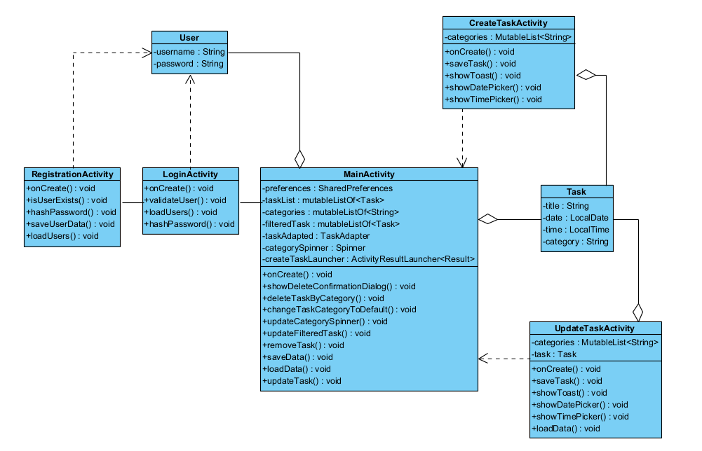

# Диаграмма классов  

 

# Глоссарий

| Класс | Описание |
|:---|:---|
| MainActivity | Главное окно приложения |
| RegistrationActivity | Окно регистрации |
| LoginActivity | Окно входа |
| CreateTaskActivity | Окно создания задачи |
| UpdateTaskActivity | Окно редактирования задачи |
| Task | Класс события |
| User | Класс пользователя |