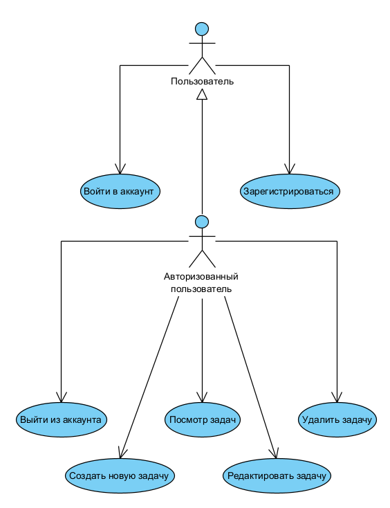

# Диаграмма вариантов использования

 
  
# Глоссарий

| Термин | Определение |
|:--|:--|
| Пользователь | Человек, использующий приложение |
| Авторизованный пользователь | Пользователь, прошедший авторизацию в приложении |
  
# Поток событий 

# Содержание
1 [Актёры](#actors)  
2 [Варианты использования](#use_case)  
2.1 [Войти в аккаунт](#sign_in_to_your_account)  
2.2 [Зарегистрироваться](#sign_up)    
2.3 [Просмотр задач](#sign_in_as_visitor)  
2.4 [Выйти из аккаунта](#view_film_list)  
2.5 [Редактировать задачу](#find_film_in_list)  
2.6 [Удалить задачу](#find_film_info)  
2.7 [Создать задачу](#view_film_info)     

<a name="actors"/>

# 1 Актёры

| Актёр | Описание |
|:--|:--|
| Пользователь | Человек, использующий приложение |
| Авторизованный пользователь | Пользователь, прошедший авторизацию в приложении |

<a name="use_case"/>

# 2 Варианты использования

<a name="sign_in_to_your_account"/>

## 2.1 Войти в аккаунт

**Описание.** Вариант использования "Войти в аккаунт" позволяет пользователю войти в учётную запись.  
**Предусловия.** Пользователь выбрал способ "Вход" для входа в приложение.  
**Основной поток.**
1. Приложение отображает окно входа в аккаунт;
2. Пользователь вводит данные;
3. Пользователь подтверждает ввод;
4. Приложение запоминает имя пользователя и загружает его данные;
5. Приложение скрывает окно входа в аккаунт;
6. Вариант использования завершается.

<a name="sign_up"/>

## 2.2 Зарегистрироваться

**Описание.** Вариант использования "Зарегистрироваться" позволяет пользователю создать свой аккаунт в приложении.  
**Предусловия.** Gользователь захотел зарегистрироваться в приложении, выбрав пункт меню "Регистрация".  
**Основной поток.**
1. Приложение отображает окно регистрации, в котором запрашивает у пользователя ввод данных;
2. Пользователь вводит данные;
3. Пользователь подтверждает ввод;
4. Приложение проверяет введённое имя на совпадение с именами уже зарегистрированных пользователей. Если совпадение выявлено, выполняется альтернативный поток А1;
5. Приложение создает аккаунт пользователя в базе данных;
6. Приложение скрывает окно регистрации;
7. Вариант использования завершается.

**Альтернативный поток А1.**
1. Приложение сообщает пользователю, что пользователь с таким именем уже существует;
2. Приложение запрашивает у пользователя ввод другого имени;
3. Возврат к п.2 основного потока.

<a name="sign_in_as_visitor"/>

## 2.3 Просмотр задач

**Описание.** Любой пользователь может просматривать задачи.   
**Основной поток.**
1. Приложение отображает окно задач;
2. Пользователь выбирает категорию задач.
3. Приложение выполняет фильтрацию по выбранной категории.
4. Вариант использования завершается.

<a name="view_film_list"/>

## 2.4 Выйти из аккаунта

**Описание.** Вариант использования "Выйти из аккаунта" позволяет авторизованному пользователю выйти из аккаунта.  
**Предусловия.** Авторизованный пользователь нажал на кнопку "Выход".  
**Основной поток.**
1. Приложение сбрасывает настройки под пользователя и производит выход из аккаунта;
2. Вариант использования завершается.

<a name="find_film_in_list"/>

## 2.5 Редактировать задачу

**Описание.** Вариант использования "Редактировать задачу" позволяет авторизованному пользователю редактировать созданные им задачи.  
**Предусловия.** Пользователь нажал на задачу в списке задач.
**Основной поток.**
1. Приложение выводит окно редактирования задач;
2. Пользователь изменяет необходимые данные;
3. Пользователь подтверждает ввод;
4. Приложение обновляет данные о задаче;
5. Вариант использования завершается.

<a name="find_film_info"/>

## 2.6 Удалить задачу

**Описание.** Вариант использования "Удалить задачу" позволяет авторизованному пользователю удалить свою задачу.  
**Предусловия.** Пользователь нажал кнопку "Удалить" для своей задачи.  
**Основной поток.**
1. Приложение удаляет задачу из списка;
2. Вариант использования завершается.

<a name="view_film_info"/>

## 2.7 Создать задачу

**Описание.** Вариант использования "Создать задачу" позволяет авторизованному пользователю создавать новые задачи.  
**Предусловия.** Пользователь нажал на кнопку "Создать задачу".
**Основной поток.**
1. Приложение выводит окно создания задач;
2. Пользователь вводит необходимые данные;
3. Пользователь подтверждает ввод;
4. Приложение сохраняет данные о задаче;
5. Вариант использования завершается.
